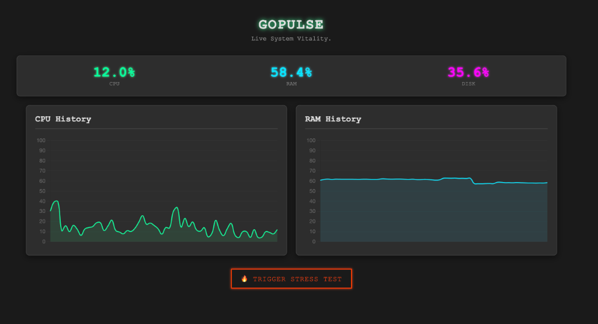

   ______      ____        __
  / ____/___  / __ \__  __/ /z______
 / / __/ __ \/ /_/ / / / / / ___/ _ \
/ /_/ / /_/ / ____/ /_/ / (__  )  __/
\____/\____/_/    \__,_/_/____/\___/
             SYSTEM ONLINE v1.0

# GoPulse

GoPulse is a Real-Time System Monitor Dashboard built with **Go (Golang)**, **WebSockets**, and **Chart.js**. It provides live visualization of CPU, RAM, and Disk usage with a high-performance backend and a Cyberpunk/NASA-inspired interface.

## 🚀 Features

*   **Real-Time Monitoring**: Updates CPU, RAM, and Disk stats every second via WebSockets.
*   **Live Graphs**: Smooth, dark-mode line charts using Chart.js.
*   **Stress Test Simulation**: Includes a "🔥 Trigger Stress Test" feature to artificially spike CPU usage for 10 seconds, demonstrating real-time responsiveness.
*   **Modern UI**: Fully responsive, dark-themed dashboard.



## 🛠 Tech Stack

*   **Backend**: Go 1.22+
*   **System Stats**: `github.com/shirou/gopsutil`
*   **WebSockets**: `github.com/gorilla/websocket`
*   **Frontend**: HTML5, CSS3 (Custom Dark Theme), Chart.js, HTMX.

## 📦 Installation & Usage

1.  **Clone the repository:**
    ```bash
    git clone https://github.com/ahmedmaaloul/GoPulse.git
    cd GoPulse
    ```

2.  **Install dependencies:**
    ```bash
    go mod tidy
    ```

3.  **Run the application:**
    ```bash
    go run cmd/server/main.go
    ```

4.  **Access the Dashboard:**
    Open your browser and navigate to `http://localhost:8080`.

## 🔥 Stress Test Demo

1.  Open the dashboard at `http://localhost:8080`.
2.  Click the **"🔥 Trigger Stress Test"** button.
3.  Watch the **CPU History** graph spike instantly!
4.  The load will automatically dissipate after 10 seconds.

---
*Built with ❤️ in Go.*
